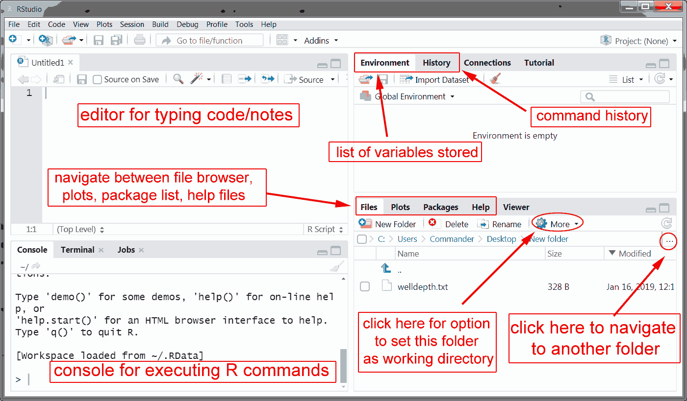

# Introduction to R and RStudio

R is a statistical software package and a computer programming language.
It is widely used in both industry (e.g. by data scientists) and academic research.
RStudio is a graphical interface for R.
Here I will give a brief introduction to R and RStudio.

## Getting access to R and RStudio

There are two main ways to use R:

(1) install R and RStudio locally on your computer, or

(2) use Posit cloud.
    (Posit is the company that makes RStudio)

**Posit Cloud:**

I strongly suggest getting an account on Posit Cloud (this is the company that makes RStudio).
Then you have access to a fully-capable and up-to-date version of R and RStudio form any web browser on any device.
Go to: <https://posit.cloud/>, and sign up.
Their free account simply has computation time limitations which should be no problem for most casual users.

Alternatively, you can download and install R and RStudio Desktop locally on your computer.
I recommend doing this, especially if you are more serious about learning R or running programs that require more computation time.

**Downloading and installing R statistical software:**

I recommend two things:

(1) Install R. This is the actual statistical software.

(2) Install RStudio Desktop.
    This is a nice user interface for R.

\*Note that the actual software version numbers change frequently, and they are, as of writing, R 4.2.2 and RStudio Desktop 2022.12.0+353.

**Getting R:**

First, download the appropriate version (Windows, Mac, etc.) of R from here: <https://cloud.r-project.org/>

For Windows:

-   Click on "Download R for Windows",

-   then click on "install R for the first time",

-   then click on "Download R-4.2.2 for Windows".

-   Then install the software.

For Mac OS:

-   Click on "Download R for macOS",

-   then click on either "R-4.2.2-arm64.pkg" or "R-4.2.2.pkg" (depending on macOS version and processor type).

-   Then install the software.

I am more proficient at Windows than Mac, but if you have trouble installing it, come see me and I should be able to help you get it figured out.
There are also Linux/Unix options---I am familiar with Ubuntu and so should be able to help on those platforms as well.

**Getting RStudio Desktop:**

After you have R installed, I recommend installing RStudio Desktop in order to have access to a more friendly user interface.
I will always be using RStudio when I show demonstrations in class.
Simply go here: <https://posit.co/download/rstudio-desktop/#download> and choose your desired version.
The webpage should automatically detect your operating system and provide you with a link to the correct version of RStudio.
You can scroll down the page and see links to various versions though.
For Windows, the first link should work: "Windows 10/11 RSTUDIO-2022.12.0-353.EXE".
For MacOS the second link should work: "macOS 11+ RSTUDIO-2022.12.0-353.DMG".
Install the software.
Done!
There is also a link for older versions of RStudio in case you have an older version of Windows, MacOS, or Linux, etc.

**Brief test of R & RStudio:**

Launch RStudio Desktop or open a Posit Cloud Workspace/Project.
Locate the "Console" subwindow.
This is where we will type our commands.
Type `x <- 3` in the console next to the "\>" (which is a command prompt that you will always type command next to).
Then press the enter or return key on your keyboard.
This saves the value of 3 for the variable x.
Then type `x+5` and hit enter.
You should see the output `[1] 8`.
This indicates the result of the computation.
The "[1]" indicates that the output is a single number.
Later on we will learn many interesting commands that are useful.
Now you know how to open RStudio and use it as a calculator!

The RStudio user interface is shown below. The most important parts are highlighted and labeled wtih brief descriptions.

**Using R online through other sources:**

Another option for using R statistical software is to use one of the many places online where you can use it through a web browser.
There are many such websites.

Here is one website where you can conveniently evaluate R code online from a web browser in any device: <https://rdrr.io/snippets/>

Another option for having quick access to R (and this is useful for a smartphone) is SageCell at: <https://sagecell.sagemath.org/>.
This website can be used to evaluate commands from a variety of programming languages (including MATLAB and Python).
Just select R from the language tab at the lower right of the textbox.
If you are familiar with MATLAB, choose the option "Octave".
Octave is basically an open source version of MATLAB and you can run MATLAB code using the Octave language option on SageCell.

## Installing and using packages in R

It is common for software developers to develop libraries or packages which contain functions and methods. The purpose is the same as a mathematical function. Rather than you rewriting the equation each time, you can program the function and simply call that computer function with a single letter rather than a complicated formula. As an example, R has some base functionality for matrix computations, but in order to raise matrices to exponents, you need to `expm` package.

Generally to install a package named "packagename" we execute the command `install.packages("packagename")`. Once a package is installed, in order to use the methods and functions it includes, they must be loaded into R's active workspace and can be done by executing the command `library(packagename)`. 

In order to run the stock simulation code we need to install the packages `quantmod` and `RQuantLib`. To do this, execute the commands: `install.packages("quantmod")` and `install.packages("RQuantLib")`. You'll see some output indicating what R is doing, downloading some files, unpacking them, and installing them. Sometimes it may even be compiling some code in the background. Usually it takes a few seconds to minutes to install a new package.

Once a package is installed, in order to use the methods and functions it includes, execute the command `library(packagename)`, e.g. `library(quantmod)`. Notice that installing a package require quotation marks around the package name, but calling it into R's workspace does not.

<!-- ## Calculating probabilities -->

<!-- *under construction* -->

<!-- ## Simulation of random variables -->

<!-- *under construction* -->

## Random variables

R has built in methods for many different random variables. Generally for each random variable there are four methods: `dname()` (pmf or pdf), `pname()` (cdf), `qname()` (quantiles), and `rname()` (random simulation) where you replace "name" by the name of a particular distribution.

Here are the R names for some common distributions:

| Binomial | binom |
|Exponential | exp|
|Normal|norm|
|Poisson|pois|

## Basics of programming, R scripts

*under construction*

## Importing datasets

*under construction*

## Summary 

::: defbox
**Summary of notation, formulas, and terminology**

*under construction*

:::
